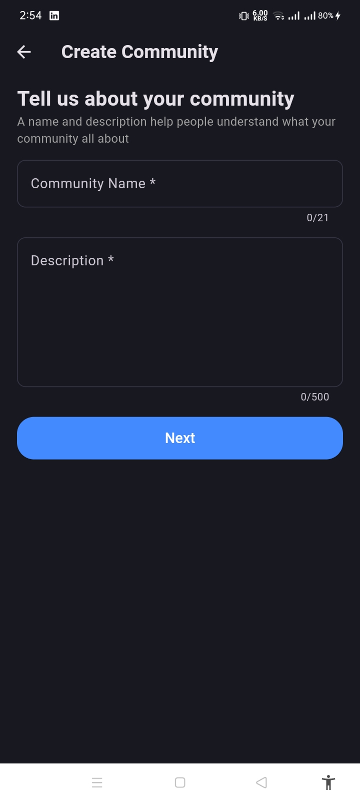
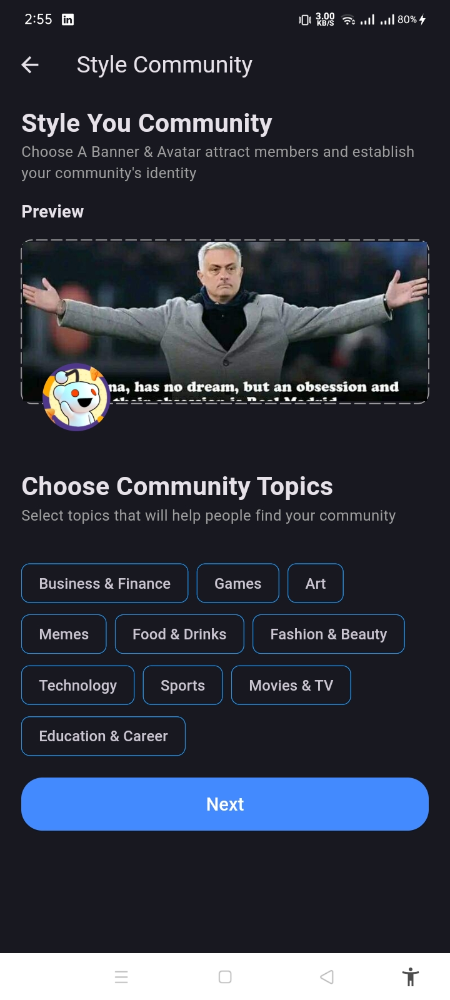
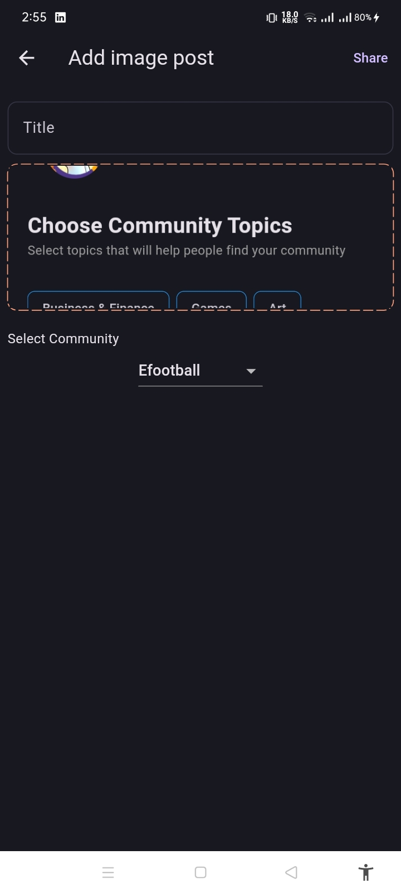
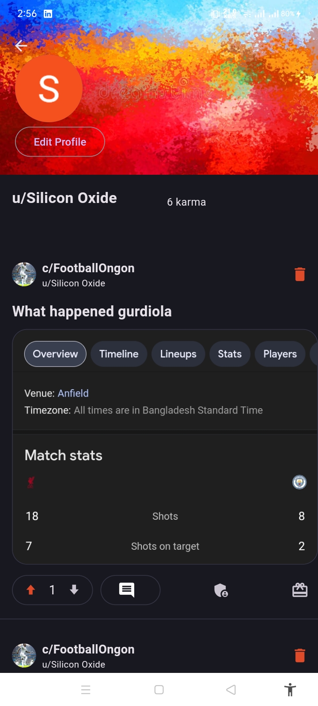

# 🧠 Reddit Clone

A **full-featured social discussion app** inspired by Reddit — built with modern technologies to explore authentication, community building, post creation, voting, and more.

---

## 🚀 Overview

This project is a complete Reddit-like application where users can:
- Sign in using Google authentication
- Create and join communities
- Post different content types (text, image, or link)
- Interact through upvotes/downvotes and nested comments
- Manage profiles, moderators, and community settings

It aims to demonstrate **real-world social media app architecture**, state management, and backend integration.

---

## 🧩 Features

### 🔐 Authentication
- Secure Google Sign-In (OAuth)
- Persistent login session

### 🧑‍🤝‍🧑 Communities
- Create new communities
- Join/Leave communities
- Add moderators to manage the community

### 📝 Posts
- Create post types: **Text**, **Link**, and **Image**
- Edit and delete posts
- Upvote / Downvote system
- Sort posts by votes or time

### 💬 Comments
- Nested (threaded) comment system
- Real-time updates

### 🏆 Awards
- Give and display awards on posts
- Track award counts per user

### 👤 Profile Management
- Update profile picture and banner
- View user’s posts and awards

---

## 🛠️ Tech Stack

| Layer | Technology |
|-------|-------------|
| **Frontend** | Flutter |
| **Backend** | Firebase Firestore / Firebase Auth |
| **State Management** | Riverpod |
| **Storage** | Firebase Storage |
| **Authentication** | Google Sign-In |
| **Hosting** | Firebase Hosting (optional) |

---

## 📸 Screenshots

<div>




</div>

<div>



</div>

---

## ⚙️ Setup Instructions

1. **Clone the repository**
   ```bash
   git clone https://github.com/Aziz-Ru/reddit_clone.git
   cd reddit_clone
   
2. **Install dependencies**
 ```bash
  flutter pub get
```
3. **Set up Firebase**
   - Create a new Firebase project.
   - Enable Authentication (Google).
   - Enable Cloud Firestore and Storage.
   - Download the google-services.json file and place it in android/app/.
4. **Run the app**
   ```bash
   flutter run
## 🗂️ Folder Structure
```
lib/
 ┣ features/
 ┃ ┣ auth/
 ┃ ┣ community/
 ┃ ┣ post/
 ┃ ┣ profile/
 ┣ core/
 ┣ models/
 ┣ common/
 ┗ main.dart
```

## Dependencies

- flutter_riverpod — State management
- firebase_core — Firebase initialization
- firebase_auth — Authentication
- cloud_firestore — Database
- firebase_storage — File uploads
- google_sign_in — OAuth integration
- cached_network_image — Efficient image caching

## Future Improvements

- Add push notifications
-  Real-time chat between users
-   Advanced moderation tools
-   Community analytics dashboard
-    Mobile + Web responsive UI
